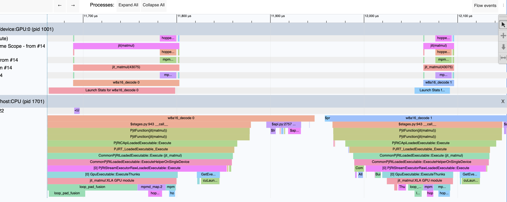

This guide covers three things: running the benchmark across workloads, reading the numbers it prints, and profiling with XProf and Nsight Compute when the numbers aren't enough.

## 1. Workloads

The script ships with ten decode workloads, each one a single projection from Llama-style 8B and 70B models. Pick them with `--scenario` and their zero-based index.

| Index | Projection     |  M |     K |     N |
| ----: | -------------- | -: | ----: | ----: |
|     0 | 8B gate or up  |  1 |  4096 | 14336 |
|     1 | 8B down        |  1 | 14336 |  4096 |
|     2 | 8B gate or up  |  4 |  4096 | 14336 |
|     3 | 8B down        |  8 | 14336 |  4096 |
|     4 | 8B gate or up  | 16 |  4096 | 14336 |
|     5 | 70B Q          |  1 |  8192 |  8192 |
|     6 | 70B gate or up |  1 |  8192 | 28672 |
|     7 | 70B down       |  1 | 28672 |  8192 |
|     8 | 70B down       |  8 | 28672 |  8192 |
|     9 | 70B gate or up | 16 |  8192 | 28672 |

M can be thought of as the number of tokens in the batch, K is the input width, and N is the output width. Leaving out `--scenario` runs all ten.
<br>

## 2. Running the benchmark

Always start by checking that the kernel paths are correct:

```bash
python -m pallasforge.hopper.w8a16 --check --scenario 0
```

Then tune and benchmark the workloads you care about. Tuning saves the winning configuration for each shape to the JSON file:

```bash
python -m pallasforge.hopper.w8a16 --tune --benchmark --scenario 0 1 5 6 7 --configs w8a16_configs.json
```

Once the configurations are saved, you can benchmark again without retuning:

```bash
python -m pallasforge.hopper.w8a16 --benchmark --configs w8a16_configs.json
```

Other useful flags:

- `--warmup` and `--iterations` set how many calls run before and during timing. The defaults are 5 and 20.
- `--device` picks a GPU when the machine has more than one.

The saved configurations are tied to the device, the JAX version and the numerical contract. If any of those change, the script refuses to load them until you retune. It does **not** notice changes to the kernel code itself, so retune after editing the kernel.
<br>

## 3. What the benchmark prints

For each workload, you get output like this:

```
Checks passed; max absolute error=0.00383031
Max NRMSE=0.00165989
fused_w8a16        CUPTI median GPU time: 21.09 us
prepared_bf16      CUPTI median GPU time: 41.20 us
jax_w8a16          CUPTI median GPU time: 38.59 us
Fused versus prepared BF16: 1.95x faster
Output relative L2 error versus original BF16 weights: 0.00909216
```

`fused_w8a16` is our kernel. `prepared_bf16` is a plain BF16 matmul with weights converted ahead of time, outside the timed call. `jax_w8a16` is the same math written in plain JAX and compiled by XLA.

The last line measures quantization error, not kernel error. It compares our output with what the original, unquantized BF16 weights would give. It should be around 0.01 and should not change between configurations. If it does change, something other than quantization is going on.
<br>

## 4. What to look for

**Correctness first.** Your kernel may be fast, but it will mean nothing if it is not correct. Always check correctness of the kernel first. A passing run shows NRMSE around 1.7e-3, well under the 3e-3 limit. A sudden jump toward the limit after a kernel change is worth investigating even if it still passes.

**Speedup over BF16.** At M = 1, the kernel reads half the bytes BF16 does, so about 2× is the ceiling. Our runs land between 1.65× and 1.95×. As M grows, each weight is reused more, conversion and math take a larger share of the time, and the advantage should shrink. You can find out the saturation point by running it for different batch sizes.

**Achieved bandwidth.** Speedup alone doesn't give the full picture. We also need to know how close are we to the hardware limit.  Divide the bytes read by the fused time:

```
bandwidth = (N × K + split-K partial bytes) / time
partial bytes = 2 × split_k × N × padded_M × 4      (written once, read once; 0 without split-K)
```

Compare the result with the hardware you have on hand. For example, in this case we have 4.8 TB/s peak for the H200. Real kernels may not reach the full peak, but the gap shows how much room is left. In our runs the large 70B projections reach 75–79% and the small ones only about 60%, which points to a fixed cost per call that matters more when there is less data.

**Noise.** Run the same command two or three times before trusting a small difference. If two configurations differ by less than the spread between repeated runs, treat them as equal.

**A quiet GPU.** Check with `nvidia-smi` that no other process is using the GPU. A hot or busy GPU runs at lower clocks and gives slower, noisier numbers.

**Register spills.** Larger tiles can push register use past the limit and spill to slower memory. Run with `MOSAIC_GPU_DUMP_PTXAS=1` to print the compiler's report for each kernel, and look for nonzero spill counts.
<br>

## 5. What CUPTI timing means

CUPTI is a better profiling interface for GPUs. It lets a tool read the time each kernel spends running on the GPU, taken from timestamps the GPU records.

The script's numbers are the median over all iterations of the GPU time for one complete call. A complete call can be several kernels: the main kernel, the split-K reduce kernel, and XLA's padding and slicing kernels. All of them count.

What it leaves out is everything on the CPU side: compilation, Python, and the time to dispatch the call. That makes it a good measure of the kernel itself, but not of end-to-end latency in a real serving loop, where dispatch overhead also matters.

Different tools report different numbers for the same kernel, and that's expected:

- **tune-jax** In our runs it read about 6 µs higher than CUPTI and ranked close configurations differently. The overhead is coming from somewhere which I am not sure of. I would recommend to use CUPTI numbers when comparing.
- **XProf** shows kernel times on a timeline with gaps between them. It adds some profiling overhead.
- **Nsight Compute** reruns each kernel on its own at locked clocks (see section 7), so its durations usually come out longer.
<br>

## 6. Profiling with XProf

XProf shows what runs on the GPU during a call, in order, on a timeline. Use it to see which kernels a call actually launches and how long each one takes.

Capture a trace with the tuned configuration. `--profile` has to run on its own, without `--tune` or `--benchmark`:

```bash
python -m pallasforge.hopper.w8a16 --profile --scenario 0 --configs w8a16_configs.json
```

The trace is written to `w8a16_profiles/m1_k4096_n14336`, one folder per workload. View it with:

```bash
pip install xprof
xprof --port 8791 w8a16_profiles/m1_k4096_n14336
```

Then open `http://localhost:8791` and go to the trace viewer. Here is a view of the xprof's trace viewer: <br>



<br>

**What to look for:**

- **Steps.** Each call is marked as a `w8a16_decode` step, so you can line up kernels with calls.
- **Which kernels run.** Each step should show `hopper_w8a16_split_k` and, with split-K, `hopper_w8a16_reduce_split_k`. You will also see XLA kernels for padding M up to `tile_m` and, without split-K, for slicing the padded rows off.
- **How long each one takes.** At around 20 µs per call, a 2–3 µs padding or reduce kernel is a real share of the total. This is the first place to look for the fixed cost that holds small shapes at about 60% of peak.
- **Gaps between kernels.** Idle time between kernels in the same step is time the GPU isn't working.
<br>

## 7. Profiling with Nsight Compute

Nsight Compute (`ncu`) looks inside a single kernel. It reports hardware counters such as memory throughput, occupancy and what warps are waiting on. Use it once XProf has told you which kernel to look at.

**Permissions.** Reading GPU counters often needs extra permission. If you see `ERR_NVGPUCTRPERM`, run with `sudo` or ask an admin to enable counter access for non-root users.

**Which run to profile.** `ncu` and other in-process profilers may not work together, and both `--benchmark` and `--profile` start CUPTI-based profiling inside the script. The `--check` mode doesn't, and it still runs the tuned configuration after its own path checks:

```bash
ncu --section SpeedOfLight --section MemoryWorkloadAnalysis --section LaunchStats \
    --section Occupancy --section WarpStateStats \
    -k regex:hopper_w8a16 --launch-skip 24 --launch-count 2 -o w8a16_s0 \
    python -m pallasforge.hopper.w8a16.py --check  --scenario 0 --configs w8a16_configs.json
```

- `--section` collects only the sections listed. Each section needs its own replays of the kernel, so `--set full`, which collects all of them, can take minutes. Use it only on a single launch, when you need something the sections above don't show.
- `-k regex:hopper_w8a16` keeps only our kernels and skips XLA's.
- `--launch-skip 24` skips the launches from `--check`'s own path checks. With `--no-gemv`, those are 8 launches for the direct path and 16 for split-K (main plus reduce kernel).
- `--launch-count 2` then takes the tuned main kernel and its reduce kernel. Use 1 if the tuned configuration has no split-K.

Without persistence, the main kernel's grid is:

```
blocks = split_k × ceil(M / tile_m) × (N / tile_n)
```

For example, the scenario 0 winner with `split_k=4` and `tile_n=64` has 4 × 1 × 224 = 896 blocks. The reduce kernel's grid is `M × (N / 64)`.

Open the report with `ncu-ui w8a16_s0.ncu-rep`, or print it in the terminal with `ncu --import w8a16_s0.ncu-rep --page details`.

**Clocks.** By default, `ncu` locks the GPU to its base clock while profiling, so durations come out longer than CUPTI's. That keeps runs comparable with each other. If you want durations closer to normal running, add `--clock-control none`.

**What to look for:**

- **GPU Speed Of Light.** This section shows how busy memory and compute are as a percentage of peak. This kernel should be limited by memory, so DRAM throughput should be the high number. If it isn't, the kernel is spending time on something other than streaming weights.
- **Memory Workload Analysis.** Multiply the memory throughput by the duration to get the bytes moved. For the main kernel, that should be close to `N × K` plus any split-K partials. Much more than that means extra traffic you didn't expect. This section also shows whether registers spill.
- **Source Counters.** This section isn't in the command above. Add `--section SourceCounters` to see which instructions stall the most and to get warnings about uncoalesced global accesses. Expect such a warning for the reduce kernel, whose loads are strided.
- **Launch Statistics and Occupancy.** These show registers per thread, shared memory per block, and how many blocks fit on each SM. If occupancy is limited by registers or shared memory, the report says which.
- **Warp State Statistics.** This lists what warps spend their time waiting on. For a kernel limited by memory, waiting on memory loads should be the top reason. A large share of waiting at barriers or on WGMMA points to synchronization costs instead.

### Example: scenario 0

This is the report for the scenario 0 winner (8B gate/up, M = 1, `tile_m=8`, `tile_n=64`, `tile_k=128`, 3 stages, `split_k=4`). The full output is at the end of this section. The numbers worth reading are below.

**Main kernel, `hopper_w8a16_split_k`**

| Metric                     | Value                  | Where it comes from        |
| -------------------------- | ---------------------- | -------------------------- |
| Grid size                  | 896                    | Launch Statistics          |
| Duration                   | 19.58 µs               | GPU Speed Of Light         |
| DRAM throughput            | 3.14 TB/s (65.5%)      | Memory Workload Analysis   |
| SM active / elapsed cycles | 28,175 / 35,069 (80%)  | GPU Speed Of Light         |
| Registers per thread       | 63                     | Launch Statistics          |
| Shared memory per block    | 30.74 KB               | Launch Statistics          |
| Block limit                | 7 per SM, shared memory | Occupancy                 |
| Waves per SM               | 0.97                   | Launch Statistics          |
| Local memory spills        | 0                      | Memory Workload Analysis   |
| Top stall                  | L1TEX scoreboard, 54%  | Warp State Statistics      |

**It's the right launch.** The grid is 896, which matches 4 × 1 × 224 from the formula above.

**No hidden traffic.** 3.14 TB/s × 19.58 µs ≈ 61.5 MB. The expected traffic is 58.7 MB of weights plus 1.8 MB of FP32 partials written (4 × 14336 × 8 × 4 bytes), about 60.5 MB. The two are close, so the kernel reads each weight once and nothing extra.

**Shared memory matches the estimate.** With 3 stages, `3 × (2 × 8 × 128 + 64 × 128)` = 30,720 bytes, which is the 30.74 KB shown. That is what limits occupancy: only 7 blocks fit per SM. 7 × 132 = 924 slots for 896 blocks, so all blocks run in a single wave.

**About 20% of the time, SMs are idle.** The SMs are active for only 80% of the elapsed cycles. That fits a single wave: SMs that finish their blocks early have nothing else to do, and the kernel takes time to ramp up at the start. This is part of the fixed cost that holds small shapes near 60% of peak.

**What warps wait on.** The top stall is waiting on L1TEX, which covers global and local memory accesses, not shared memory. This report alone doesn't show which instruction causes it. Rerun one launch with `--section SourceCounters` to find it.

**Reduce kernel, `hopper_w8a16_reduce_split_k`**

| Metric             | Value               |
| ------------------ | ------------------- |
| Grid size          | 224 (1 × 14336 / 64) |
| Duration           | 3.23 µs             |
| DRAM throughput    | 578 GB/s (12.2%)    |
| Waves per SM       | 0.11                |
| Achieved occupancy | 10.4%               |

**The reduce kernel is a big share of the call.** 3.23 µs out of 19.58 + 3.23 = 22.81 µs is about 14%. It moves only about 1.9 MB, so it doesn't need much bandwidth. Its problem is that the GPU is nearly idle while it runs. 224 blocks of 128 threads leave most SMs with little work, and each block waits on its strided loads one after another. This makes the reduce kernel the first target for cutting the fixed cost per call.

The two durations add up to 22.81 µs, while CUPTI measured 21.09 µs for the whole call. `ncu` runs each kernel separately with its own clocks and cache settings, so its durations are not expected to match CUPTI exactly.

<details>
<summary>Full ncu output</summary>

```
hopper_w8a16_split_k_mosaic_gpu_kernel (896, 1, 1)x(128, 1, 1), Context 1, Stream 14, Device 0, CC 9.0
    Section: GPU Speed Of Light Throughput
    ----------------------- ----------- ------------
    Metric Name             Metric Unit Metric Value
    ----------------------- ----------- ------------
    DRAM Frequency                  Ghz         3.19
    SM Frequency                    Ghz         1.78
    Elapsed Cycles                cycle        35069
    Memory Throughput                 %        65.48
    DRAM Throughput                   %        65.48
    Duration                         us        19.58
    L1/TEX Cache Throughput           %        31.32
    L2 Cache Throughput               %        68.34
    SM Active Cycles              cycle     28175.42
    Compute (SM) Throughput           %        54.04
    ----------------------- ----------- ------------

    Section: Memory Workload Analysis
    --------------------------------------- ----------- ------------
    Metric Name                             Metric Unit Metric Value
    --------------------------------------- ----------- ------------
    Local Memory Spilling Requests                                 0
    Local Memory Spilling Request Overhead            %            0
    L2 Sector Promotion Misses                        %            0
    Shared Memory Spilling Requests                                0
    Shared Memory Spilling Request Overhead           %            0
    Memory Throughput                           Tbyte/s         3.14
    Mem Busy                                          %        47.12
    Max Bandwidth                                     %        65.48
    L1/TEX Hit Rate                                   %            0
    L2 Persisting Size                            Mbyte        11.80
    L2 Compression Success Rate                       %            0
    L2 Compression Ratio                              %            0
    L2 Compression Input Sectors                 sector        57788
    L2 Hit Rate                                       %        10.50
    Mem Pipes Busy                                    %        20.33
    --------------------------------------- ----------- ------------

    Section: Warp State Statistics
    ---------------------------------------- ----------- ------------
    Metric Name                              Metric Unit Metric Value
    ---------------------------------------- ----------- ------------
    Warp Cycles Per Issued Instruction             cycle         8.96
    Warp Cycles Per Executed Instruction           cycle         8.96
    Avg. Active Threads Per Warp                                32.01
    Avg. Not Predicated Off Threads Per Warp                    30.06
    ---------------------------------------- ----------- ------------

    Section: Launch Statistics
    -------------------------------- --------------- ---------------
    Metric Name                          Metric Unit    Metric Value
    -------------------------------- --------------- ---------------
    Block Size                                                   128
    Grid Size                                                    896
    Registers Per Thread             register/thread              63
    Shared Memory Configuration Size           Kbyte          233.47
    Driver Shared Memory Per Block       Kbyte/block            1.02
    Dynamic Shared Memory Per Block      Kbyte/block           30.74
    Static Shared Memory Per Block        byte/block               1
    # SMs                                         SM             132
    Threads                                   thread          114688
    Waves Per SM                                                0.97
    -------------------------------- --------------- ---------------

    Section: Occupancy
    ------------------------------- ----------- ------------
    Metric Name                     Metric Unit Metric Value
    ------------------------------- ----------- ------------
    Block Limit Barriers                  block           32
    Block Limit SM                        block           32
    Block Limit Registers                 block            8
    Block Limit Shared Mem                block            7
    Block Limit Warps                     block           16
    Theoretical Active Warps per SM        warp           28
    Theoretical Occupancy                     %        43.75
    Achieved Occupancy                        %        37.66
    Achieved Active Warps Per SM           warp        24.10
    ------------------------------- ----------- ------------

hopper_w8a16_reduce_split_k_mosaic_gpu_kernel (224, 1, 1)x(128, 1, 1), Context 1, Stream 14, Device 0, CC 9.0
    Section: GPU Speed Of Light Throughput
    ----------------------- ----------- ------------
    Metric Name             Metric Unit Metric Value
    ----------------------- ----------- ------------
    DRAM Frequency                  Ghz         3.15
    SM Frequency                    Ghz         1.95
    Elapsed Cycles                cycle         6296
    Memory Throughput                 %        12.21
    DRAM Throughput                   %        12.21
    Duration                         us         3.23
    L1/TEX Cache Throughput           %         7.08
    L2 Cache Throughput               %        15.90
    SM Active Cycles              cycle      2145.70
    Compute (SM) Throughput           %         2.34
    ----------------------- ----------- ------------

    Section: Memory Workload Analysis
    --------------------------------------- ----------- ------------
    Metric Name                             Metric Unit Metric Value
    --------------------------------------- ----------- ------------
    Local Memory Spilling Requests                                 0
    Memory Throughput                           Gbyte/s       577.74
    Mem Busy                                          %         8.64
    Max Bandwidth                                     %        12.21
    L1/TEX Hit Rate                                   %         3.97
    L2 Hit Rate                                       %        12.41
    Mem Pipes Busy                                    %         2.34
    --------------------------------------- ----------- ------------

    Section: Warp State Statistics
    ---------------------------------------- ----------- ------------
    Metric Name                              Metric Unit Metric Value
    ---------------------------------------- ----------- ------------
    Warp Cycles Per Issued Instruction             cycle        39.27
    Warp Cycles Per Executed Instruction           cycle        40.79
    Avg. Active Threads Per Warp                                   32
    Avg. Not Predicated Off Threads Per Warp                       32
    ---------------------------------------- ----------- ------------

    Section: Launch Statistics
    -------------------------------- --------------- ---------------
    Metric Name                          Metric Unit    Metric Value
    -------------------------------- --------------- ---------------
    Block Size                                                   128
    Grid Size                                                    224
    Registers Per Thread             register/thread              21
    Dynamic Shared Memory Per Block       byte/block               0
    # SMs                                         SM             132
    Threads                                   thread           28672
    Waves Per SM                                                0.11
    -------------------------------- --------------- ---------------

    Section: Occupancy
    ------------------------------- ----------- ------------
    Metric Name                     Metric Unit Metric Value
    ------------------------------- ----------- ------------
    Block Limit Registers                 block           21
    Block Limit Shared Mem                block           32
    Block Limit Warps                     block           16
    Theoretical Active Warps per SM        warp           64
    Theoretical Occupancy                     %          100
    Achieved Occupancy                        %        10.39
    Achieved Active Warps Per SM           warp         6.65
    ------------------------------- ----------- ------------
```

</details>