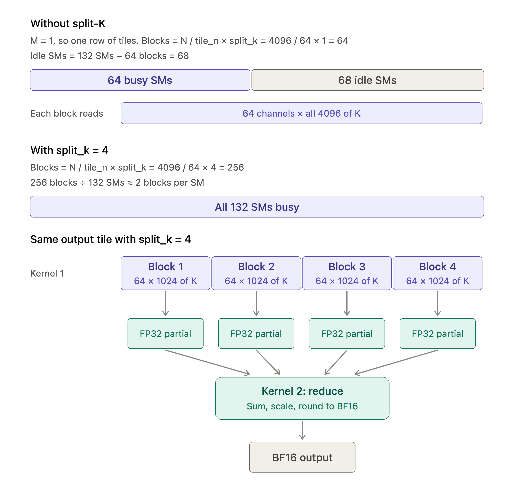

During decoding, a linear layer multiplies a large weight matrix by just one or a few rows of activations. Each weight gets used only a few times, so reading the weights from memory takes longer than the math itself.

W8A16 scheme stores weights as INT8 and keeps activations in BF16. The quantized weights have to be dequantized for matmul, so the weights have to be upcast somewhere. If the upcast runs as a separate step, it reads the INT8 weights, writes a full BF16 copy back to memory, and the matmul then reads that copy again. Performing matmul this way moves more bytes than plain BF16 would, and provides no benefits (apart from reduced storage memory because of INT8 weights)

Our kernel fuses the upcast instead. Each INT8 tile is read once, converted to BF16 in registers, and passed straight to the Tensor Cores, so a BF16 copy of the weights never reaches memory. Compilers can sometimes do this fusion on their own. Our native JAX W8A16 baseline runs faster than BF16, which suggests XLA fuses it. So the speedup shown later comes from streaming the weights more efficiently, not only from skipping the extra copy.

*Fun fact: Earlier versions of XLA were never reliable for fusion. The fusion used to happen randomly (at least on GPUs). XLA keeps getting better and better!*

If you have read the write up for normal BF16 matmul kernel example, the biggest difference you will notice here is the place where the operands sit when WGMMA reads them. Here the weights come from registers and the activations come from shared memory. That changes the data path, and it changes what work can safely overlap.

---

## 1. Inputs and what we compute

The kernel takes three inputs:

- BF16 activations $A$, shape $M × K$
- INT8 weights $W$, shape $N × K$
- one BF16 scale per output channel, shape $N$

$M$ is the number of activation rows, $K$ is the input width, and $N$ is the output width. For single-token decoding at batch size 1, $M$ is 1.

The weights are quantized ahead of time. Each stored integer, multiplied by its channel's scale, gives back the original weight. The name W8A16 describes how the data is stored. It doesn't mean the hardware multiplies INT8 by BF16. Hopper has no such instruction, so the kernel converts each INT8 weight tile to BF16 before the multiply. The conversion is exact, because every INT8 value from -128 to 127 fits in BF16 with no rounding. The converted values are still the unscaled integers, just stored as BF16.

The kernel multiplies the activations by these converted weights on the Tensor Cores, adds everything up in FP32, and applies the scale at the end.

 

## 2. Turn the product around

The usual way to write the product is:

$Z = A \ @ \ W.T$

Our kernel computes the transpose instead:

$Z.T = W \ @ \ A.T$

The values are the same. The only change is that output channels now run along the rows of the accumulator, and batch rows run along its columns.

This orientation matches Hopper's WGMMA shape requirements where the row dimension of a WGMMA is 64, but the column dimension can be as small as 8. With the batch along the columns, a batch of 1 gets padded to 8 rather than 64. The padding still wastes 7/8 of the Tensor Core work, but this kernel is limited by memory, so the extra math costs almost nothing. The padded rows are dropped before the result is returned.

For example, with `tile_m=8`, `tile_n=64` and `tile_k=256`, one pipeline step combines:

- a `64 × 256` weight tile,
- a transposed activation tile of shape `256 × 8`, and
- an FP32 accumulator of shape `64 × 8`.

`tile_m` and `tile_n` keep their usual meaning. `tile_m` is the number of activation rows a tile covers, and `tile_n` is the number of output channels it covers. What changes is which side of the WGMMA each one lands on. `tile_n` becomes the WGMMA's row count, which must be a multiple of 64. `tile_m` becomes its column count, which only needs to be a multiple of 8. That's why the accumulator in the example above is `64 × 8` (`tile_n × tile_m`), not `8 × 64`.
 
Nothing has to be transposed in memory for this to work. The weights are stored as $N × K$, which is already the shape the WGMMA's left operand needs. The activations are read through a transposed view of their shared-memory tile, without being copied. The only real transpose happens at the end. The accumulator is `tile_n × tile_m`, so the kernel flips it while writing it out, and the output in memory is $M × N$. With split-K, the reduce kernel does this flip instead.

 

## 3. Two operands, two paths

Both input tiles first arrive in shared memory through TMA, Hopper's asynchronous copy engine. After that, they go different ways.

The activation tile stays in shared memory as BF16. WGMMA reads it directly, through a transposed view. The weight tile arrives as INT8. The kernel loads it into registers, arranges the values in the layout WGMMA expects, and converts them to BF16.

This only works because WGMMA allows its left operand to come from registers. The right operand has to come from shared memory. NVIDIA's [Warpgroup MMA Programming Guide](https://docs.nvidia.com/cutlass/latest/media/docs/pythonDSL/guides/mma/wgmma_programming.html) states this directly: $B$ must be staged in shared memory, while $A$ can come from shared memory or registers. Putting the weights on the left lets WGMMA use the converted values directly, without writing a BF16 tile back to shared memory first.

But there is a cost to it. Loading and conversion of weights add work to every step, and the converted weights take up registers alongside the accumulator. Larger tiles use more registers, which can mean fewer thread blocks fit on each SM. 

 

## 4. What overlaps and what doesn't

`plgpu.emit_pipeline` handles moving input tiles into shared memory. It keeps a ring of buffers, so future tiles can arrive while the kernel works on a tile that's already there. More stages allow more copies in flight, but use more shared memory.

Each loop step does four things:

1. load the weight tile into registers
2. convert it to BF16
3. issue the WGMMA
4. call `wgmma_wait(0)`

`wgmma_wait(0)` makes the step wait until its WGMMA has finished. TMA (Tensor Memory Accelerator) copies for future steps keep running during that time, so loading still overlaps with the multiply. What doesn't overlap is the next step's conversion. It can't start until the current WGMMA is done.

So "pipelined" here means memory traffic is hidden behind compute. It doesn't mean loading, converting and multiplying all run at the same time.

It might seem that switching to `wgmma_wait(1)` would let the next conversion run alongside the current WGMMA. But `wgmma_wait(1)` only allows the newest WGMMA to keep running. It says nothing about whether the registers that WGMMA is reading are safe to overwrite. A running WGMMA reads its register operand in the background, and those registers must not change until it finishes. If the next step's converted weights land in the same registers, the running WGMMA reads the wrong values.

When we tried `wgmma_wait(1)`, the results turned out to be numerically incorrect. That fits the explanation above, but we haven't confirmed it yet. The next check is whether it also fails with three or more pipeline stages. Either way, overlapping conversion with WGMMA safely needs a schedule that keeps each set of weight registers intact until its WGMMA completes. Changing the wait value alone won't do that.

 

## 5. How long each buffer has to live

There are three input buffers to keep track of:

| Storage                        | Must stay valid until                |
| ------------------------------ | ------------------------------------ |
| INT8 weight tile in SMEM       | it has been loaded into registers    |
| converted BF16 weights in registers | the WGMMA using them has finished |
| BF16 activation tile in SMEM   | the WGMMA reading it has finished    |

Once the weights are in registers, WGMMA no longer needs the INT8 tile in shared memory. It needs the registers. The activation tile is different, because WGMMA reads it straight from shared memory.

`delay_release` controls when the pipeline can reuse a shared-memory buffer. With `delay_release=0`, a buffer is freed as soon as the step that used it returns. With `delay_release=1`, it's freed one step later. That's useful when a step returns while a WGMMA is still reading the buffer, as happens with `wgmma_wait(1)`.

`delay_release=1` has a cost: one buffer is always held back, so only `stages - 1` buffers are prefetching. With two stages, that leaves just one. It also only protects shared memory. It does nothing for register operands, so it can't fix the `wgmma_wait(1)` problem from section 4.

The kernel thus uses `delay_release=0`. Since every step ends with `wgmma_wait(0)`, the WGMMA is already done by the time the step returns, so freeing the buffer right away is safe. Holding it longer would protect nothing and would only take a buffer away from prefetching.

 

## 6. Split-K, when there aren't enough tiles

At batch size 1 there is only one row of output tiles, so the number of thread blocks depends almost entirely on N. With `N=4096` and `tile_n=64`, that's 64 blocks on an H200 with 132 SMs, which leaves about half the GPU with nothing to do.

Split-K fixes this by giving different blocks different parts of the same dot product. With four splits, the same example launches 256 blocks, and each one handles a quarter of K.

 

Each block writes its unscaled FP32 partial sum to a workspace laid out the same way as the accumulator, with channels along the rows. That lets the kernel store straight from registers, without a trip through shared memory. A second Mosaic kernel then adds up the partials for each channel, applies the scale, and converts the result to BF16.

The partials cost extra memory traffic: they are written once and read once more. For the 8B gate/up projection with `split_k=4`, that's about 3.7 MB on top of 58.7 MB of weights, or roughly 6%. There's also a second kernel launch. Split-K pays off when the extra parallelism saves more time than that.

Split-K also changes the order of the additions, so results can differ slightly from the direct path. The correctness checks allow for that.

## 7. What can be reused in L2

At batch size 1, each output tile reads a different part of the weight matrix, and each weight is needed only once per call. The only thing many blocks share is the activation vector.

With more than one row of output tiles, the same weights are needed again for each row. The panel and snake order that we saw in the BF16 kernel can then bring those reads closer together in time, which improves the chances of an L2 hit. It only makes a hit more likely. It doesn't control which blocks run when or what stays in the cache.

With a single row of tiles, the kernel skips the panel order. The winning configurations in our measurements also turned out to be all runs with non-persistent.
So the real job here is to stream weights efficiently and keep enough memory requests in flight. A low L2 hit rate on its own doesn't mean this kernel is doing badly.

 

## 8. Apply the scale and write the result

All $K$ weights in an output channel share one scale, so the scale can be pulled outside the sum:

$\sum_k a_{m,k} \, (q_{n,k} \, s_n) = s_n \sum_k a_{m,k} \, q_{n,k}$

That keeps the scale out of the inner loop. The kernel finishes the FP32 sum, multiplies by the channel scale in FP32, and rounds to BF16 once.
The order matters. Scaling each weight first and rounding it to BF16 would add rounding error to every product. Our reference follows the *accumulate-then-scale* order. **If the weights were quantized in groups along K, each group would need its own scale, and this shortcut wouldn't apply.**

Without split-K, the kernel scales the finished tile, converts it to BF16, and writes it into output shared memory in the transposed $M × N$ order. It then commits those writes, starts an asynchronous copy to global memory, and waits for the copy before reusing the buffer.

With split-K, the main kernel only writes FP32 partials. The reduction kernel does the scaling, conversion and final write.

 

## 9. Results

Batch size 1 on an H200:

| Projection  | Prepared BF16 | Native JAX W8A16 | Fused W8A16 | vs BF16 | vs JAX W8A16 |
| ----------- | ------------: | ---------------: | ----------: | ------: | -----------: |
| 8B gate/up  |      41.20 µs |         38.59 µs |    21.09 µs |   1.95× |        1.83× |
| 8B down     |      33.50 µs |         29.20 µs |    19.95 µs |   1.68× |        1.46× |
| 70B Q       |      37.49 µs |         32.70 µs |    22.75 µs |   1.65× |        1.44× |
| 70B gate/up |     112.45 µs |        102.22 µs |    65.46 µs |   1.72× |        1.56× |
| 70B down    |     118.03 µs |        102.45 µs |    62.13 µs |   1.90× |        1.65× |

"Prepared BF16" multiplies by BF16 weights that were converted ahead of time, outside the timed call. "Native JAX W8A16" is the plain JAX version, an upcast followed by a matmul, compiled by XLA. Its times suggest XLA fuses the upcast, so treat it as XLA's best effort rather than an unfused baseline. These are CUPTI GPU times for the full compiled call, including padding and the split-K reduction kernel. They don't include compilation or host dispatch.

Dividing the weight bytes (`N × K`) by the fused time gives the achieved bandwidth:

| Projection  | Weights  | Bandwidth | % of 4.8 TB/s |
| ----------- | -------: | --------: | ------------: |
| 8B gate/up  |  58.7 MB | 2.78 TB/s |           58% |
| 8B down     |  58.7 MB | 2.94 TB/s |           61% |
| 70B Q       |  67.1 MB | 2.95 TB/s |           61% |
| 70B gate/up | 234.9 MB | 3.59 TB/s |           75% |
| 70B down    | 234.9 MB | 3.78 TB/s |           79% |

These figures count only the weights. Where split-K is used, the true traffic is a few percent higher. The large projections get much closer to peak than the small ones. That points to a roughly fixed cost per call that matters more when there is less data to move.

The configurations were picked with `tune-jax`. Its timer ranks configurations a little differently from CUPTI (probably some overhead), so some of these numbers may improve when retuned with pure CUPTI timing.

These are single-projection timings. They don't show the speedup of a full decoding step, which also includes attention and other work. The benefit is largest for big projections at small batch sizes. At larger batches, each weight is reused more, and the cost of conversion and compute starts to matter more.

---

 

To summarize, compared with the simple BF16-BF16 matmul kernel:

    - store weights as INT8 to halve the bytes read from memory
    - flip the product so the weights fill WGMMA's 64-row side
    - convert weights to BF16 in registers and feed WGMMA from there
    - let TMA hide the loads, but wait for each WGMMA before converting the next tile
    - split K when there are too few output tiles to fill the GPU
    - apply the scale once, in FP32, and round to BF16 at the end